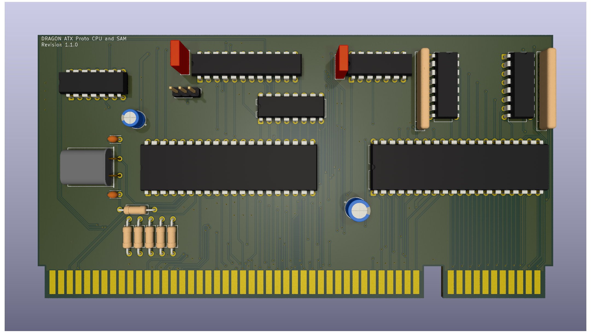

# Dragon 32 ATX Prototype CPU and SAM

This repository contains the KiCad project files
to produce the CPU and SAM component board for my
ATX Prototype backplane.

This design requires the ATX backplane board in order 
to operate
See https://github.com/jimbro1000/DragonATXProto

## Notes

Revision 1 of the board contains just a standard
SAM. Revision 2 will use the later version of the SAM
(74LS785) that provides 256 refresh cycles instead of 
the 128 of the original SAM (74LS783).

Revision 3 will utilise a synthetic version of the SAM
developed by Ciaran Anscomb.

The backplane includes a mounting point for a more
substantial synthetic implementation of the SAM that
means the SAM can be omitted completely on any of the
CPU/SAM board implementations

This design has been completed using KiCad 9. Earlier
versions of KiCad are not compatible.
